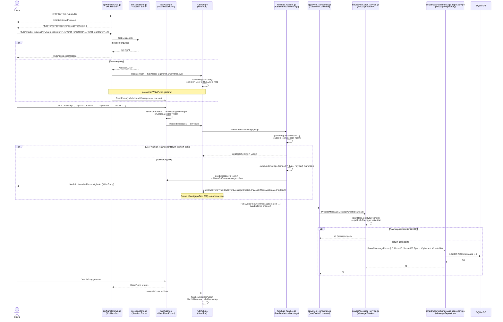

# Architecture Flow — WebSocket Auth → Datenbank

## Nachrichtenfluss (Message Flow)

## Komponentenübersicht

| Schicht | Komponente | Aufgabe |
|---|---|---|
| Transport | `api/handlers/ws.go` | WebSocket-Upgrade, Auth-Handshake, Pump-Start |
| Auth | `session/store.go` | In-Memory Session-Lookup (sessionID → User) |
| Realtime | `hub/hub.go` | Zentraler Event-Loop (channel-basiert) |
| Realtime | `hub/hub_handler.go` | Nachrichtenrouting, Room-Validierung, Event-Emission |
| Realtime | `hub/user.go` | ReadPump / WritePump pro WebSocket-Verbindung |
| Event-Bridge | `app/event_consumer.go` | Asynchroner Consumer: Hub-Events → Services |
| Business | `service/message_service.go` | Ephemeral-Check, Delegation an Repository |
| Persistenz | `infrastructure/db/message_repository.go` | SQL INSERT/SELECT gegen SQLite |

## Wichtige Design-Entscheidungen

- **Auth first**: Der WsHandler akzeptiert als erste Nachricht ausschließlich `type:"auth"` — jede andere Nachricht schließt die Verbindung sofort.
- **Non-blocking emit**: `hub.emit()` verwirft Events wenn der Kanal voll ist (256 Puffer), damit der Hub-Loop nie blockiert.
- **Ephemeral Rooms**: Nachrichten in Räumen ohne DB-Eintrag werden nicht persistiert — kein Fehler, nur stilles Überspringen (`ProcessMessage`).
- **Entkopplung Hub ↔ DB**: Der Hub weiß nichts von der Datenbank. Die Persistierung läuft vollständig asynchron über den Event-Consumer.
